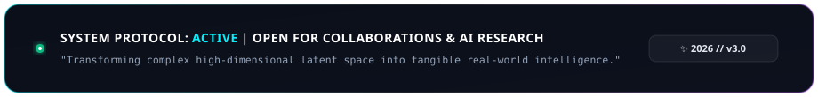

<div align="center">

  <!-- ==================== ANIMATED GLASSMORPHIC HEADER ==================== -->
  

  <br/><br/>

  <!-- Dynamic Typing Effect Subtitle -->
  <a href="https://github.com/Arham-15">
    
  </a>

  <p align="center">
    <a href="#-about-me">About Me</a> •
    <a href="#-tech-stack--ai-arsenal">Tech Stack</a> •
    <a href="#-featured-projects">Featured Projects</a> •
    <a href="#-github-metrics--analytics">Analytics</a> •
    <a href="#-connect--collaborate">Connect</a>
  </p>

</div>


## 🔮 About Me

```yaml
scholar:
  name: Arham
  handle: Arham-15
  degree: B.S. in Computer Science / Artificial Intelligence (In Progress)
  focus_areas:
    - Generative AI & Large Language Models (LLMs)
    - Financial Machine Learning & NLP
    - Predictive Analytics & Supervised Regression
    - End-to-End MLOps & Cloud Architecture
  current_mission: "Engineering intelligent, reliable AI architectures for complex real-world decision making."
```

<table>
  <tr>
    <td width="50%" valign="top">
      <h3>🚀 What I'm Exploring Right Now</h3>
      <ul>
        <li>🤖 <b>Financial NLP &amp; LLM Reasoning:</b> Building autonomous conversational financial agents.</li>
        <li>📈 <b>Document Intelligence:</b> Extracting insights from corporate filings &amp; financial reports.</li>
        <li>⚡ <b>Predictive ML Pipelines:</b> Developing robust regression and classification systems.</li>
      </ul>
    </td>
    <td width="50%" valign="top">
      <h3>🎯 Goals for 2026</h3>
      <ul>
        <li>🏆 Publish production-ready open-source AI &amp; Financial analytics tools.</li>
        <li>☁️ Scale distributed machine learning workflows on Azure &amp; AWS.</li>
        <li>🤝 Collaborate with global AI, Data Science &amp; Open Source communities.</li>
      </ul>
    </td>
  </tr>
</table>


## 🧠 Tech Stack & AI Arsenal

<div align="center">

### 🤖 Machine Learning, Deep Learning & LLMs
<p align="center">
  
  
  
  
  
  
</p>

### 📊 Data Science, Big Data & Mathematics
<p align="center">
  
  
  
  
  
</p>

### ⚙️ MLOps, Cloud & Dev Tools
<p align="center">
  
  
  
  
  
  
  
</p>

</div>


## 🧪 Featured AI & Data Science Projects

<table>
  <tr>
    <td width="50%" valign="top">
      <h3>💼 <a href="https://github.com/Arham-15/Financial_chatbot">Financial Chatbot</a></h3>
      <p>An intelligent AI-driven financial assistant leveraging Natural Language Processing and LLM reasoning to parse financial queries, summarize market data, and provide interactive investor guidance.</p>
      <p>
        <code>Python</code> • <code>LangChain</code> • <code>OpenAI</code> • <code>Streamlit</code>
      </p>
      <a href="https://github.com/Arham-15/Financial_chatbot"><b>Explore Repository →</b></a>
    </td>
    <td width="50%" valign="top">
      <h3>📊 <a href="https://github.com/Arham-15/ai-financial-report-analyze">AI Financial Report Analyzer</a></h3>
      <p>Generative AI pipeline engineered to ingest complex corporate financial statements, 10-K filings, and balance sheets, extracting key performance metrics and executive summaries.</p>
      <p>
        <code>PyTorch</code> • <code>FastAPI</code> • <code>Document AI</code> • <code>NLP</code>
      </p>
      <a href="https://github.com/Arham-15/ai-financial-report-analyze"><b>Explore Repository →</b></a>
    </td>
  </tr>
  <tr>
    <td width="50%" valign="top">
      <h3>🎓 <a href="https://github.com/Arham-15/Student-Performance-Prediction">Student Performance Prediction</a></h3>
      <p>End-to-end Machine Learning system analyzing student demographics, socioeconomic factors, and academic metrics to accurately forecast test scores and identify key success factors.</p>
      <p>
        <code>Scikit-Learn</code> • <code>Pandas</code> • <code>NumPy</code> • <code>EDA</code>
      </p>
      <a href="https://github.com/Arham-15/Student-Performance-Prediction"><b>Explore Repository →</b></a>
    </td>
    <td width="50%" valign="top">
      <h3>🏡 <a href="https://github.com/Arham-15/House_Price_Prediction">House Price Prediction</a></h3>
      <p>Comprehensive multivariate regression architecture utilizing advanced data preprocessing, feature engineering, and ensemble regression models to forecast real estate valuations.</p>
      <p>
        <code>Python</code> • <code>Scikit-Learn</code> • <code>Regression</code> • <code>Seaborn</code>
      </p>
      <a href="https://github.com/Arham-15/House_Price_Prediction"><b>Explore Repository →</b></a>
    </td>
  </tr>
</table>


## 📊 GitHub Metrics & Analytics

<div align="center">

  <!-- GitHub Streak Stats (High Reliability) -->
  <a href="https://github.com/Arham-15">
    
  </a>

  <br/><br/>

  <!-- GitHub Activity Graph -->
  <a href="https://github.com/Arham-15">
    
  </a>

  <br/><br/>

  <!-- GitHub Stats & Top Languages Grid -->
  <table border="0">
    <tr>
      <td>
        <a href="https://github.com/Arham-15">
          
        </a>
      </td>
      <td>
        <a href="https://github.com/Arham-15">
          
        </a>
      </td>
    </tr>
  </table>

  <br/><br/>

  <!-- Contribution Snake Animation -->
  <picture>
    <source media="(prefers-color-scheme: dark)" srcset="https://raw.githubusercontent.com/Arham-15/Arham-15/output/github-contribution-grid-snake-dark.svg">
    <source media="(prefers-color-scheme: light)" srcset="https://raw.githubusercontent.com/Arham-15/Arham-15/output/github-contribution-grid-snake.svg">
    
  </picture>

</div>


## 🌐 Connect & Collaborate

<div align="center">

<p align="center">
  <a href="https://www.kaggle.com/arham1597">
    
  </a>
  <a href="https://huggingface.co/arham15">
    
  </a>
  <a href="https://github.com/Arham-15">
    
  </a>
  <a href="mailto:your.email@example.com">
    
  </a>
  <a href="https://linkedin.com/in/">
    
  </a>
</p>

</div>

<!-- ==================== ANIMATED GLASS FOOTER ==================== -->

